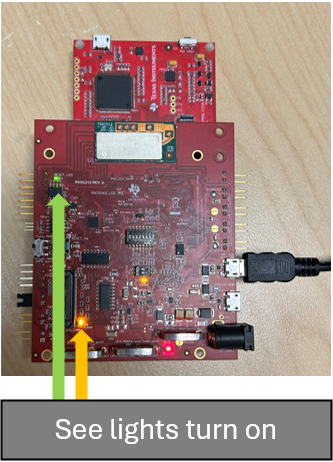
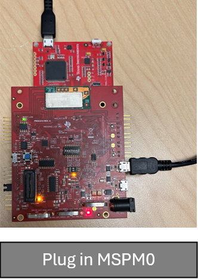
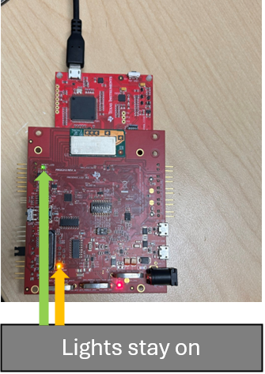
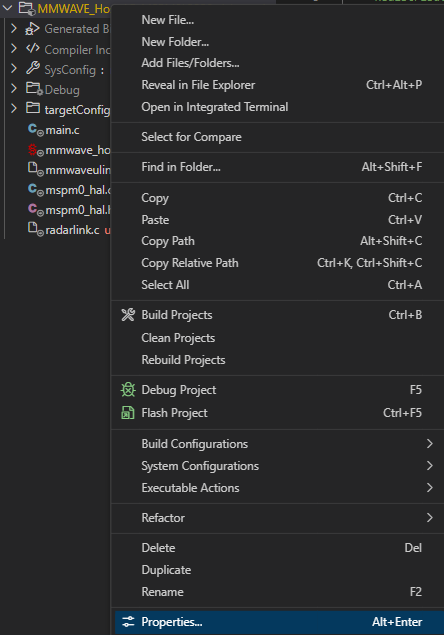
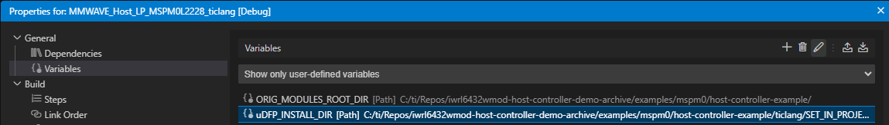
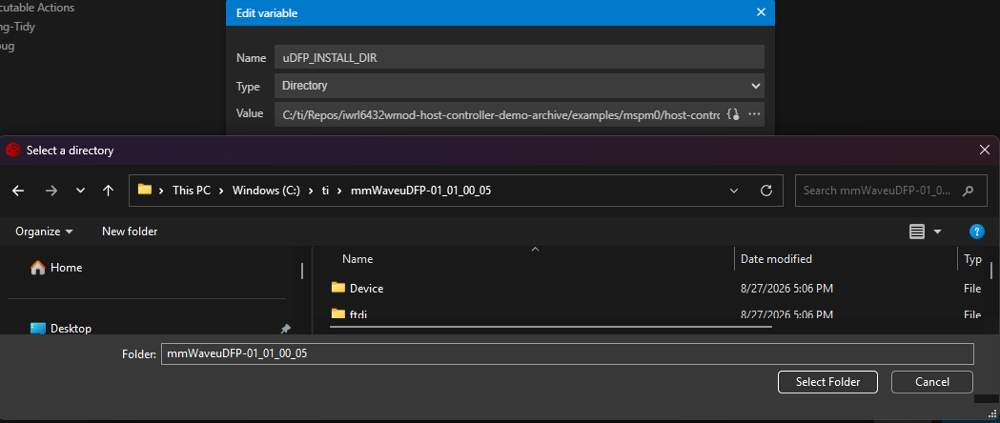

<div align="center">

<picture>
  <source media="(prefers-color-scheme: dark)" srcset="https://www.ti.com/content/dam/ticom/images/identities/ti-brand/ti-logo-hz-1c-white.svg" width="300">
  
</picture>

# IWRL6432WMOD Host Controller Demo

This repository contains host controller firmware for the [IWRL6432WMOD](https://www.ti.com/product/IWRL6432WMOD) industrial mmWave radar module, running on the [MSPM0L2228](https://www.ti.com/product/MSPM0L2228) LaunchPad.

[Summary](#summary) | [Features](#features) | [Supported Devices](#supported-devices) | [Background](#background) | [Setup Instructions](#setup-instructions) | [Build Instructions](#build-instructions) | [Related Repos](#related-repos) | [Licensing](#licensing) | [Contributions](#contributions) | [Developer Resources](#developer-resources)

</div>

## Summary

Host controller firmware that configures the IWRL6432WMOD mmWave radar module via SPI and responds to presence detection events.

## Features

- SPI-based communication with IWRL6432WMOD using the mmWave uDFP
- Interrupt-driven presence detection with GPIO wake signal
- LED indication on detection events
- Hardware abstraction layer (HAL) for MSPM0L2228 peripherals: SPI, GPIO, LCD, CRC, SysTick

## Supported Devices

| Device | Role | Product Page |
|---|---|---|
| [IWRL6432WMOD](https://www.ti.com/product/IWRL6432WMOD) | mmWave radar module | ti.com/product/IWRL6432WMOD |
| [MSPM0L2228](https://www.ti.com/product/MSPM0L2228) | Host MCU (ARM Cortex-M0+) | ti.com/product/MSPM0L2228 |

## Required Evaluation Hardware: 
[BP-IWRL6432WMOD boosterpack](https://www.ti.com/tool/BP-IWRL6432WMOD)
[MSPM0L2228 LaunchPad](https://www.ti.com/tool/LP-MSPM0L2228)

## Background

This repository is a demonstration project, not a full SDK. It shows one way to integrate the IWRL6432WMOD radar module with an MSPM0 host MCU using the uDFP host library. The project depends on two external components not included in this repository:

- **MSPM0 SDK** (validated with version 2.10.00.04) — provides DriverLib and SysConfig support
- **mmWave uDFP** (validated with version 1.1.0.5) — provides the mmWaveULink host library

Both must be installed before building. See [Build Instructions](#build-instructions).

## Setup Instructions

### Hardware Connections

The following pins should be connected between MSPM0L2228 LaunchPad and the BP-IWRL6432WMOD. This can be accomplished simply by aligning the Launchpad and Boosterpack headers on the two devices.

| Function | MSPM0L2228 Pin | IWRL6432WMOD Pin |
|---|---|---|
| WAKE UP | PA30 | J15.8 |
| SPI BUSY | PB3 | J15.1 |
| PRESENCE DETECTION | PB2 | J15.3 |
| SPI CLK | PA17 | J14.13 |
| SPI PICO (MOSI) | PB8 | J15.12 |
| SPI POCI (MISO) | PB7 | J15.14 |
| SPI CS | PB6 | J15.16 |

### Power-Up Sequence

The BP-IWRL6432WMOD requires an initial USB power connection to boot. Follow these steps exactly:

**Step 1.** Connect USB to the XDS110 or FTDI port on the BP-IWRL6432WMOD. Confirm all LEDs illuminate. Leave the MSPM0L2228 LaunchPad unplugged.



**Step 2.** Connect USB to the MSPM0L2228 LaunchPad.



**Step 3.** Unplug USB from the BP-IWRL6432WMOD. Confirm its LEDs remain on — the MSPM0 is now supplying power through the SPI interface.



## Build Instructions

### Dependencies

Install the following before building:

| Dependency | Validated Version | Source |
|---|---|---|
| MSPM0 SDK | 2.10.00.04 | [ti.com/tool/MSPM0-SDK](https://www.ti.com/tool/MSPM0-SDK) |
| mmWave uDFP | 1.1.0.5 | https://www.ti.com/tool/download/MMWAVE-UDFP-APPSW/01.01.00.05 |
| Code Composer Studio | 20.x or later | [ti.com/tool/CCSTUDIO](https://www.ti.com/tool/CCSTUDIO) |
| SysConfig | 1.27.0 or later | Bundled with CCS |

### Repath uDFP Links

Until there is a new release patching the uDFP paths, you must perform the following:
1. Navigate to {uDFP Directory} > Host > mmWaveUlink
2. In your IDE of choice, open mmWaveUlink.
3. Make the following modifications:
    * radarlink.c: change line 33 from `#include "mmwave_api/radarlink/radarlink.h"` to `#include "radarlink.h"`
    * radarlink.h: change line 44 from `#include <mmwave_api/mmwaveulink.h>` to `#include "mmwaveulink.h"`
    * mmwaveulink.c: change lines 37-39 from 
    ```c
    #include <mmwave_api/mmwaveulink.h>
    #include <mmwave_api/radarlink/radarlink.h>
    #include <mmwave_api/ulinkversion.h>
    ```
    to
    ```c
    #include "mmwaveulink.h"
    #include "radarlink/radarlink.h"
    #include "ulinkversion.h"
    ```

### Option 1 — Import into Code Composer Studio (recommended)

1. Open CCS and go to **File → Import → C/C++ → CCS Projects**.
2. Browse to `examples/mspm0/host-controller-example/ticlang/`.
3. Select `M0_Host_LCD_mmwaveulink.projectspec` and click **Finish**.
4. In the project properties, set the `uDFP_INSTALL_DIR` variable to the root of your uDFP installation.
    1. Right-click MMWAVE_Host_LP_MSPM0L2228_ticlang in your workspace and click Properties...
    
    2. Under General, click Variables, click the uDFP_INSTALL_DIR variable, then click the pen in the top right to edit the
    
    3. Change Type to Directory, then click the three dots on the right of the Value field. Navigate to where your installation of the uDFP is located and press Select Folder
    
    4. Press Save and Close. The files should no longer be unresolved.
5. Build and flash to the MSPM0L2228 LaunchPad.

### Option 2 — Makefile

```bash
cd examples/mspm0/host-controller-example/ticlang
make `MSPM0_SDK_INSTALL_DIR="path/to/mspm0sdk" `uDFP_INSTALL_DIR="path/to/udfp" `TICLANG_ARMCOMPILER="path/to/arm/compiler" `SYSCONFIG_TOOL="path/to/sysconfig"
```
Here is an example make command:
```bash
make `MSPM0_SDK_INSTALL_DIR="C:/ti/mspm0_sdk_2_10_00_04" `uDFP_INSTALL_DIR="C:/ti/mmWaveuDFP-01_01_00_05" `TICLANG_ARMCOMPILER="C:/ti/ccs2050/ccs/tools/compiler/ti-cgt-armllvm_4.0.4.LTS" `SYSCONFIG_TOOL="C:/ti/ccs2050/ccs/utils/sysconfig_1.27.0/sysconfig_cli.bat"
```

Clean:

```bash
make clean `MSPM0_SDK_INSTALL_DIR="path/to/mspm0sdk" `uDFP_INSTALL_DIR="path/to/udfp" `TICLANG_ARMCOMPILER="path/to/arm/compiler" `SYSCONFIG_TOOL="path/to/sysconfig"
```

The build output is `mmwave_host_lcd.out`, ready to flash with CCS or UniFlash.

## Related Repos

- [MSPM0 SDK](https://github.com/TexasInstruments/mspm0-sdk) — DriverLib, SysConfig modules, and examples for MSPM0 devices

## Licensing

Source files in this repository are licensed under the BSD 3-Clause License. See the license header in each source file for full terms.

## Contributions

This repository is not currently accepting community contributions.

---

## Developer Resources

[TI E2E™ design support forums](https://e2e.ti.com) | [Learn about software development at TI](https://www.ti.com/design-development/software-development.html) | [Training Academies](https://www.ti.com/design-development/ti-developer-zone.html#ti-developer-zone-tab-1) | [TI Developer Zone](https://dev.ti.com/)
